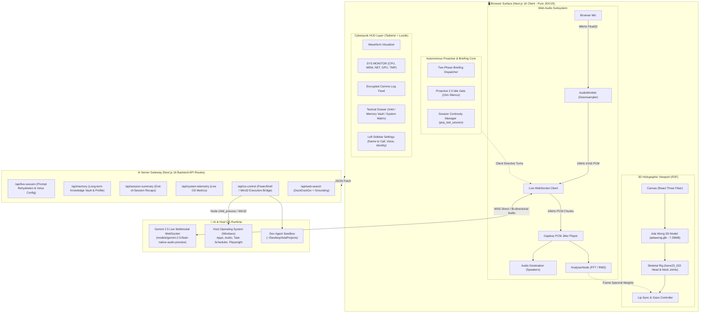

# ⚡ SYSTEM ARCHITECTURE — PROJECT ULTRON

**Codename:** Project ULTRON // Cyber-Grid Architecture Blueprint  
**Stack:** Next.js 16 (App Router + Turbopack) + Three.js + Pure JavaScript (JSX) + Web Audio API + Gemini 3.1 Live WebSocket  
**Active 3D Core:** Holographic 3D Ultron Orb (`ultronOrbScene.js`) with MediaPipe Vision (`handTracker.js`)  

---

## 1. High-Level Cybernetic Architecture

The system consists of four distinct architectural layers:

1. **Client Holographic Surface (Next.js 16 + Three.js + Web Audio + JSX):** Renders the authentic 3D Ultron Orb with real-time multi-state kinetics (IDLE, THINKING, SPEAKING), speech-driven volumetric core dilation, Web Audio mic ingestion (`AudioWorkletNode`), low-latency 24kHz PCM playback (`pcmPlayer.js`), and the Cyberpunk Stark Gold HUD.
2. **Autonomous Proactive & Briefing Engine:** Operates client-side and edge background monitors including:
   - **Two-Phase Morning Briefing:** Dispatches instant spoken greeting (<1s) upon WebSocket setup, followed by parallel headline news delivery.
   - **Proactive 2.0 Idle Checker:** Gated silence evaluator (15 min idle) triggering unprompted voice check-ins with rotating context.
   - **Session Continuity Manager:** Buffers conversation turns, invokes summarization on exit, and consumes last-session memory on next boot.
3. **Secure WebSocket Gateway & Edge Proxy (Next.js 16 App Router):** Maintains secure, low-latency WebSocket communication with Google's Gemini 3.1 Multimodal Live API, handling session tokens, tool definitions, and system prompts.
4. **Host OS Automation & Intelligence Engine:** Local companion bridge routes (`/api/os-control`, `/api/system-telemetry`, `/api/web-search`, `/api/weather`) and automation modules (Playwright browser automation, Dev Agent, and OS system execution).



---

## 2. 3D Model Specification: `adawong.glb`

The active avatar asset is located at [`docs/adawong.glb`](./adawong.glb) (to be deployed to `public/models/adawong.glb`):

- **File Footprint:** `7.29 MB` (Extremely lightweight, well within web performance limits).
- **Format:** glTF 2.0 Binary (`.glb`) with 1 Skinned Rig and 248 Nodes.
- **Component Meshes (10 Sub-objects):**
  1. `mesh4_...pl0100_00Face_BM_0`: Face & head geometry.
  2. `mesh11_...pl0100_31SideHair_BM_0`: Signature bob hairstyle.
  3. `mesh1_...pl1200_11nuno_BM_0`: Crimson combat dress ("nuno").
  4. `mesh10_...pl1200_12Acc_BM_0`, `mesh2`, `mesh8`: Tactical holsters, belts, and buckles.
  5. `mesh0_...pl1200_13hand_BM_0`, `mesh3`: Hand models.
  6. `mesh6_...pl1200_14Skin_BM_0`: Exposed skin / shoulders / arms.
  7. `mesh7_...pl1200_10Leg_BM_0`: Legs and combat boots.
- **Skeletal Rig & Bone Hierarchy:**
  - Total Joints: **220 bones** mapped under `_rootJoint`.
  - Spine & Chest: `bone20_021` ➔ `bone21_00`.
  - Neck Joint: `bone22_01` (Node 105).
  - Head Joint: `bone23_022` (Node 104) — primary target for gaze tracking.
  - Facial & Eye Nodes: Child bones of `bone23_022` (`bone41_040`, `bone48_047`, etc.).
- **Animation Approach:**
  - **Interactive Gaze Tracking:** Procedural interpolation of `bone23_022` (Head) and `bone22_01` (Neck) toward screen cursor coordinates via `Quaternion.slerp`.
  - **Idle Life Cycle:** Sine-wave breathing oscillations applied to `bone21_00` (Spine) and root transform.
  - **Lip-Sync Engine:** Dual-mode architecture:
    1. _Direct Blendshape Mode:_ If morph targets (`jawOpen`, `mouthSmile`) are baked into `mesh4_...Face_BM` via Blender Shape Keys, the Web Audio `AnalyserNode` drives `morphTargetInfluences`.
    2. _Skeletal Fallback Mode:_ If running the unedited raw rig, the Web Audio `AnalyserNode` drives vertical translation/rotation of jaw/chin child bones under `bone23_022`.

---

## 3. Project Directory Structure (Next.js 16 + Pure JSX)

```
ada_autonomous-desktop-agent/
├── public/
│   ├── models/
│   │   └── adawong.glb                 # Active 7.29MB 220-joint Ada Wong model
│   ├── audio-worklet-processor.js      # Off-thread 48kHz ➔ 16kHz Int16 PCM downsampler
│   └── favicon.ico
│
├── data/
│   ├── memories.json                   # Persistent operator knowledge vault (identity, projects)
│   ├── sessions.json                   # Consumed session continuity recaps for morning briefing
│   └── monitors.json                   # Background tracked topic headlines and hashes
│
├── app/
│   ├── api/
│   │   ├── live-session/route.js       # Ephemeral token minting, tools config & system instruction
│   │   ├── memory/route.js             # Long-term knowledge base CRUD
│   │   ├── system-telemetry/route.js   # Live Windows OS hardware metrics (CPU, RAM, GPU, Net)
│   │   ├── web-search/route.js         # DuckDuckGo + Grounded intelligence search
│   │   └── os-control/route.js         # Local PowerShell / Win32 host execution bridge
│   ├── page.jsx                        # Main Cyberpunk HUD & 3D Stage orchestration
│   ├── layout.jsx                      # Root layout, fonts (Orbitron, JetBrains Mono, Rajdhani)
│   └── globals.css                     # Neon CSS tokens, CRT scanline keyframes
│
├── components/
│   ├── Canvas3D/
│   │   ├── AdaViewport.jsx             # R3F Canvas wrapper with camera presets & live FPS monitor
│   │   ├── AdaAvatar.jsx               # adawong.glb loader, bone hierarchy & lip driver
│   │   ├── CyberStage.jsx              # Concentric holographic rings, cyber stage floor & lighting
│   │   └── PostFX.jsx                  # Direct WebGL pass-through with optional cyber optics
│   ├── HUD/
│   │   ├── AudioWaveform.jsx           # Oscillating neon frequency visualizer canvas
│   │   ├── CommsLog.jsx                # Real-time transcript feed & quick mic toggle
│   │   ├── TelemetryPanel.jsx          # Live SYS MONITOR gauges & RenderProfilerBadge
│   │   ├── TacticalDrawer.jsx          # Sliding drawer (Intel, Memory Vault, System Matrix)
│   │   └── ApiKeyModal.jsx             # Gemini API credentials modal
│   └── Vision/
│       ├── ScreenShareModal.jsx        # DisplayMedia screen capture stream & token injector
│       └── WebcamStream.jsx            # Live operator webcam feed with PIP mode
│
├── hooks/
│   ├── useGeminiLive.js                # WebSocket lifecycle, tool dispatch, proactive engine
│   ├── useAudioStream.js               # AudioWorklet ingest & PCM player integration
│   ├── useLipSync.js                   # AnalyserNode spectral decomposition ➔ jaw articulation
│   └── useGazeTracking.js              # Mouse cursor coords ➔ bone23_022 head/neck slerp
│
├── lib/
│   ├── pcmPlayer.js                    # Gapless 24kHz raw PCM jitter buffer scheduler (<50ms barge-in)
│   ├── store.js                        # Zustand global state store
│   ├── geminiLiveClient.js             # System instructions & Ada Wong persona prompt
│   ├── proactiveEngine.js              # 15-min idle silence evaluator & rotating prompt builder
│   └── browserController.js            # Playwright browser automation engine
│
├── plugins/                            # Drop-in cyber plugins (JavaScript)
│   ├── systemDiagnostic.js             # Deep hardware and network diagnostics
│   ├── cyberCrypto.js                  # Cryptographic hashing & cipher tools
│   ├── networkPing.js                  # DNS resolution & network latency checks
│   └── workspaceNavigator.js           # Git branch & codebase stats analyzer
│
└── ~/Desktop/AdaProjects/              # Autonomous Dev Agent sandbox workspace
```

---

## 4. Audio Pipeline & Real-Time Sync

1. **Capture:** Browser microphone streams Float32 samples at system rate (44.1k/48k). `audio-worklet-processor.js` downsamples off-thread to 16kHz Int16 PCM.
2. **Transmit:** Chunks (~64ms) are pushed over WebSocket as `realtime_input` with MIME `audio/pcm`.
3. **Receive:** Gemini Live returns 24kHz Int16 raw PCM audio chunks.
4. **Playback:** `pcmPlayer.js` converts chunks to Float32, buffers them into scheduled `AudioBufferSourceNode` slices, and connects to an `AnalyserNode`.
5. **Animation:** In each `requestAnimationFrame` render tick:
   - `AnalyserNode` provides FFT frequency bins.
   - Low frequencies (100–600Hz) drive jaw openness.
   - Mid/High frequencies (1.5k–4kHz) drive subtle mouth spreading/smiling.
   - Values smoothly interpolate onto `adawong.glb` facial targets.

---

## 5. Mark-LIII Settings Suite & Neural Memory Rehydration Architecture

```
[ Left Sidebar Settings Tab (TelemetryPanel.jsx) ]
  ├── Operative Name-to-Call (Callsign e.g. "Bhavya Sir")
  ├── Operative Role & Security Clearance
  ├── Behavioral Directives & Cadence
  ├── Assistant Codename (e.g. "Ada Wong")
  ├── Prebuilt Voice Selector (Aoede, Charon, Fenrir, Kore, Puck)
  └── Automation Toggles (Auto-Briefing, Start Muted)
              │
              ▼ (POST /api/memory action: 'update_profile')
[ data/memories.json (Atomic Persistence) ]
              │
              ▼
[ /api/live-session (Live Ingestion Pipeline) ]
  ├── Injects profile.voiceName into GEMINI_LIVE_CONFIG
  ├── Mandates Address Rule: "Address operator as '${callsign}', never generic Operator"
  ├── Injects [DEEP MEMORY VAULT REHYDRATION] with all active memories
  └── Declares 'update_operator_profile' Tool
              │
              ▼ (WSS Setup Frame)
[ Gemini 2.5 Live WebSocket Session ]
  └── Zero-lookup contextual recall & persistent custom address
```

