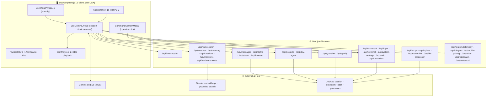

# ⚡ SYSTEM ARCHITECTURE — J.A.R.V.I.S MARK II

**Codename:** Mark II // Architecture Blueprint  
**Stack:** Next.js 16 (App Router, Turbopack) + React 19 + React Three Fiber (Three.js) + JavaScript (JSX) + Web Audio API + Gemini 3.8 Live WebSocket  
**Visual Core:** Arc Reactor Orb (`components/Canvas3D/ArcReactorOrb.jsx`)

---

## 1. High-Level Architecture

The system has four layers:

1. **Client Holographic Surface (browser):** the Arc Reactor Orb (R3F), the tactical HUD, Web Audio mic ingestion (`AudioWorkletNode` → 16 kHz PCM), 24 kHz gapless playback (`lib/pcmPlayer.js`), the wake-phrase listener, uploads, media panels, and the terminal authorization card.
2. **Live Session Orchestrator (`hooks/useGeminiLive.js`):** opens the Gemini Live WebSocket directly from the browser, sends the setup frame (persona, memories, tools, compression, resumption handle), streams audio / video / client content, executes tool calls against the local API routes, and handles barge-in, GoAway swaps, auto re-sync, background job notices, and standby.
3. **Next.js API Layer (`app/api/*`):** builds the session configuration and bridges every host capability. Routes that touch the machine reject cross-site requests (`lib/requestGuard.js`); file access is confined to sandbox roots (`lib/fsSandbox.js`).
4. **Host Integrations:** the desktop session (`.desktop` app index, `xdg-open`, MPRIS / D-Bus, xdotool / ydotool or the RemoteDesktop portal, wmctrl / GNOME Window Calls), the filesystem, project generators, `bash`, and Google APIs (Gemini embeddings, grounded search, URL context) plus keyless search sources (Brave Search, Google News RSS, Wikipedia, Bing RSS).


```mermaid
flowchart TB
    subgraph Browser ["🖥️ Browser (Next.js 16 client, pure JSX)"]
        HUD["Tactical HUD + Arc Reactor Orb"]
        Live["useGeminiLive.js (session + tool executor)"]
        Mic["AudioWorklet 16 kHz PCM"] --> Live
        Live --> Player["pcmPlayer.js 24 kHz playback"]
        Wake["useWakePhrase.js (standby)"] --> Live
        Gate["CommandConfirmModal (operator click)"]
    end

    subgraph Server ["⚙️ Next.js API routes"]
        Session["/api/live-session"]
        Files["/api/fs-ops · /api/upload · /api/model-file · /api/file-processor"]
        Desktop["/api/os-control · /api/input · /api/terminal · /api/system-settings · /api/undo · /api/reminders"]
        Intel["/api/web-search · /api/weather · /api/memory · /api/sessions · /api/monitors · /api/hardware-alerts"]
        Media["/api/youtube · /api/spotify"]
        Projects["/api/projects · /api/dev-agent"]
        Integrations["/api/messages · /api/flights · /api/steam · /api/browser"]
        Misc["/api/system-telemetry · /api/plugins · /api/mobile-pairing · /api/relay · /api/clipboard · /api/wakeword"]
    end

    subgraph External ["🧠 External & Host"]
        Gemini["Gemini 3.8 Live (WSS)"]
        GoogleAPIs["Gemini embeddings + grounded search"]
        Host["Desktop session · filesystem · bash · generators"]
    end

    Live <--> Gemini
    Live --> Session
    Live --> Files & Desktop & Intel & Media & Projects & Integrations & Misc
    Gate --> Desktop
    Intel --> GoogleAPIs
    Files & Desktop & Media & Projects & Integrations --> Host
```

---

## 2. Live Session Lifecycle

1. **Configure:** `POST /api/live-session` returns the WebSocket URL (`v1beta`), model (`GEMINI_LIVE_MODEL` in `lib/jarvisPersona.js`), voice, the dynamic system instruction (persona + operator profile + memories + allowed folders + wake phrase), and all tool declarations (every function `BLOCKING`, plus `googleSearch`).
2. **Setup:** the browser sends the setup frame with `contextWindowCompression` and, when resuming, `sessionResumption.handle`.
3. **Converse:** mic audio streams as `realtimeInput.audio`; screen / webcam frames as `realtimeInput.video`; typed text, uploads, and system notices as `clientContent` turns.
4. **Tools:** each `toolCall` is executed by the hook against the API routes; responses echo `id` + `name`; cancelled ids are dropped.
5. **Resilience:** `sessionResumptionUpdate` handles are tracked; `goAway` triggers a socket swap at the next idle turn; unexpected closes re-sync with exponential backoff (5 attempts); a refused setup that included Google Search retries once without it.
6. **Standby:** `enter_standby` closes the link after the farewell plays; the wake-phrase listener re-arms after 1.5 s offline.

---

## 3. Directory Structure

```text
jarvis-mark-ii/
├── app/
│   ├── layout.jsx / page.jsx / globals.css / manifest.js
│   ├── mobile/page.jsx                     # Mobile companion PWA
│   └── api/
│       ├── live-session/                   # Session config, persona, tools
│       ├── memory/                         # Vault manager API: CRUD, bulk, undo, merge, import / export, duplicates, voice edits, semantic recall
│       ├── sessions/                       # Conversation archive: append turns, recaps, greeting pick, search, edit, export / import, voice
│       ├── monitors/ hardware-alerts/      # Topic monitors, hardware voice alerts
│       ├── fs-ops/                         # Sandboxed file ops, organizer, documents, open
│       ├── file-processor/                 # Images, PDFs, spreadsheets, audio / video
│       ├── upload/                         # Upload ingest + text extraction
│       ├── model-file/[...segments]/       # Sandboxed 3D model serving
│       ├── os-control/                     # Apps, volume, folders, URLs, lock
│       ├── input/                          # Keyboard, mouse, windows; write_in_app
│       ├── terminal/                       # Prepare / run / cancel commands
│       ├── system-settings/                # Dark mode, WiFi, brightness, wallpaper, processes, power
│       ├── undo/                           # Reverse Jarvis's last action
│       ├── reminders/                      # OS-native reminders + due announcements
│       ├── projects/                       # Background project scaffolding jobs
│       ├── dev-agent/                      # Write / run / self-heal small projects
│       ├── wakeword/                       # Offline "Hey Jarvis" models (install / serve)
│       ├── clipboard/                      # Clipboard watcher and actions
│       ├── messages/ flights/ steam/       # Compose links, Google Flights, Steam library
│       ├── browser/                        # Jarvis browser window (Playwright)
│       ├── web-search/ weather/            # Grounded search or search-then-read, weather
│       ├── youtube/ spotify/               # Media deck
│       ├── system-telemetry/ plugins/      # Host metrics, plugin runner
│       └── mobile-pairing/ relay/          # Mobile PWA bridge
├── components/
│   ├── Canvas3D/                           # JarvisViewport, ArcReactorOrb, CyberStage, PostFX
│   ├── HUD/                                # Panels, modals, upload zone, authorization card
│   ├── Media/                              # FloatingPanel, YouTubePanel, ModelViewerPanel
│   └── Vision/                             # ScreenShareModal, WebCamPiP
├── hooks/                                  # useGeminiLive, useAudioStream, useWakePhrase, useLipSync
├── lib/
│   ├── store.js                            # useJarvisStore (Zustand)
│   ├── tools/                              # Live tool registry: one module per tool (declaration + handler)
│   ├── jarvisPersona.js                    # Persona, GEMINI_LIVE_MODEL / LABEL, live config
│   ├── pcmPlayer.js                        # Gapless 24 kHz playback + barge-in flush
│   ├── fsSandbox.js / requestGuard.js      # Safety boundaries
│   ├── folderOrganizer.js / documentForge.js / desktopLauncher.js / appIndex.js
│   ├── projectScaffolder.js / terminalRunner.js / terminalClient.js / inputControl.js
│   ├── memoryVault.js                      # Vault file (atomic writes), validation, context plan, duplicates, import
│   ├── sessionArchive.js                   # Conversation archive: sessions, recaps, greeting, retention, search, export
│   ├── memoryVectors.js / groundedSearch.js / geminiText.js / sessionRecaps.js
│   ├── searchProviders.js                  # Keyless + optional-API search sources for search-then-read
│   ├── youtubeSearch.js / spotifyControl.js / mediaClient.js
│   ├── wakePhrase.js / pluginRegistry.js / qrCode.js
│   ├── systemSettings.js / volumeControl.js / confirmGate.js / undoJournal.js / undoActions.js
│   ├── reminders.js / autostart.js / hardwareAlerts.js / topicMonitors.js
│   ├── accentTheme.js / audioDevices.js     # Fixed Arc Reactor Blue tint (ACCENT_TINT), microphone / speaker choice
│   ├── messageComposer.js / flights.js / steamLibrary.js
│   ├── fileProcessor/                      # common, images, pdf, sheets, media
│   ├── browserAgent.js                     # Playwright-driven browser with its own profile
│   ├── devAgent.js                         # Autonomous dev agent jobs
│   ├── wakeWord/                           # Offline wake word: detector, listener, models
│   ├── clipboard.js                        # Clipboard read / write, secret filter, actions
│   ├── writeInApp.js                       # write_in_app: note handoff to editors, launch-then-type
│   ├── remoteDesktopPortal.js              # Wayland keystrokes via the RemoteDesktop portal (drives bin/portal-keyboard.js)
├── bin/                                    # portal-keyboard.js (GJS portal session helper), Windows volume helper
├── plugins/                                # Drop-in cyber plugins
├── public/                                 # audio-worklet-processor.js, wakeword-worklet.js, voice samples
├── data/                                   # memories.json (vault); caches and journals are gitignored
└── docs/                                   # PRD, ARCHITECTURE, DESIGN, RULES, PHASES, MEMORY
```

---

## 4. Audio Pipeline & Visual Sync

1. **Capture:** the microphone streams Float32 at the device rate; `audio-worklet-processor.js` downsamples off-thread to 16 kHz Int16 PCM.
2. **Transmit:** ~64 ms chunks go over the WebSocket as `realtimeInput.audio` (`audio/pcm;rate=16000`); a client-side RMS gate triggers instant barge-in.
3. **Receive:** Gemini Live returns 24 kHz Int16 PCM plus input / output transcriptions for the Comms Log.
4. **Playback:** `pcmPlayer.js` schedules gapless `AudioBufferSourceNode` slices through an `AnalyserNode`; `stopAndFlush()` clears everything within 50 ms.
5. **Visual sync:** the Arc Reactor Orb reads status and analyser energy each frame (zero allocations in `useFrame()`) to drive core size, light intensity, sweep speed, and particle motion.

---

## 5. Profile, Memory & Settings Flow

```
[ SciFiSettingsModal / update_operator_profile tool ]
  ├── Callsign, assistant codename, role, clearance, directives
  ├── Voice core (16 male Gemini voices), humour, auto-briefing, mic default
  └── Wake phrase (enabled + phrase)
              │
              ▼ POST /api/memory { action: 'update_profile' }
[ data/memories.json ]
              │
              ├──▶ /api/live-session: profile, address mandate, memories in context, allowed folders, wake phrase → system instruction
              └──▶ /api/memory GET ?query=: semantic ranking (lib/memoryVectors.js, data/memory-vectors.json) with keyword fallback
```

**Memory vault (Phase 10):** every read and write of `data/memories.json` goes through `lib/memoryVault.js` (temp file + rename, validated fields). `contextPlan()` picks the memories Jarvis gets in full (15 slots: pinned, then importance, then newest; humour memories muted while humour is off) and is shared by `/api/live-session` and the vault manager, so the HUD's IN CONTEXT / ON RECALL badges are exactly what the prompt contains. Writes to `/api/memory` are same-origin only. Deletes, merges, imports, and Jarvis's own stores and voice edits are `memory_changed` records in the undo journal (`lib/undoJournal.js`): spoken "undo" pops the newest, and the HUD's undo toast reverses its specific record (`action: 'restore'`). Voice edits (`memory_vault`) act only when one memory clearly matches by raw embedding similarity (≥ 0.70 and 0.04 ahead, or a distinctive-word lead), otherwise return candidates for Jarvis to ask about.

**Session archive (Phase 11):** `useGeminiLive` starts a session id when a fresh link is established (resumes and carry-over re-links keep it) and sends the Comms Log's new operator / Jarvis turns to `POST /api/sessions { action: 'append' }` every 10 turns or 2 minutes, and with `final: true` on disconnect, standby, auto-standby, or page close (`sendBeacon`, key in the body). `lib/sessionArchive.js` keeps `data/sessions.json` (atomic writes): turns are redacted (`redactSecrets` in `lib/clipboard.js`), a final append writes title / recap / language with a Gemini text model (re-recapped when a continued conversation ends again), and a new session closes and recaps any left open by a crash. The greeting takes `action: 'greeting'`: the operator-queued recap, else the newest one if not yet mentioned, which is marked "mentioned". Retention prunes unpinned, ended sessions past the configured days or beyond 200; "recaps only" drops a transcript when its session ends. Deletes and imports are `session_changed` undo records. CONTINUE (HUD or `session_history`) archives the current conversation, shows the old one's last turns, and re-links with them as history plus the recap; new turns append to the old session.

---

## 6. Safety Boundaries

| Boundary | Mechanism |
| :-- | :-- |
| Cross-site requests | `lib/requestGuard.js` rejects foreign `Sec-Fetch-Site` / `Origin` on host-touching routes |
| Files | `lib/fsSandbox.js` allow-listed roots (`JARVIS_FS_ROOTS`), symlink-safe resolution, `.git` blocked, no delete, backups on overwrite |
| Terminal | Read-only auto-run; everything else needs an operator click on the HUD card; one-time tokens; sudo / destructive commands refused; timeouts kill the process group |
| Generated code | The dev agent runs code only after the HUD card is authorized; files stay inside the project folder; packages install inside the project (venv, `npm --ignore-scripts`) |
| System actions | Power, WiFi off, and ending programs return a card request; `lib/confirmGate.js` releases the action only for the one-time token the HUD click sends; power waits 10 s and can be cancelled; session-critical processes and Jarvis's own server are never offered |
| Clipboard | Watching is opt-in; the first poll only primes; passwords, keys, tokens, and codes are never shown or sent; nothing reaches Gemini until a button is clicked |
| Undo | `data/fs-journal/undo-stack.json` (last 10 actions); undoing a created file moves it into the journal, and is refused once the operator has edited it |
| Uploaded / fetched content | Persona rules treat it as content, never instructions; it can never approve a command |
| Secrets | The Gemini key stays in the browser (`localStorage`) and is forwarded per request header to same-origin routes only |

---

## 7. Third-Party Models

| Model | Licence | How it gets here |
| :-- | :-- | :-- |
| openWakeWord `melspectrogram`, `embedding_model`, `hey_jarvis_v0.1` (offline wake word) | CC BY-NC-SA 4.0 (non-commercial; code Apache-2.0) | Not committed. Settings → Standby Wake Phrase → INSTALL OFFLINE downloads them from the openWakeWord v0.5.1 release into `data/wakeword/` (gitignored), checked against pinned SHA-256 sums. |
