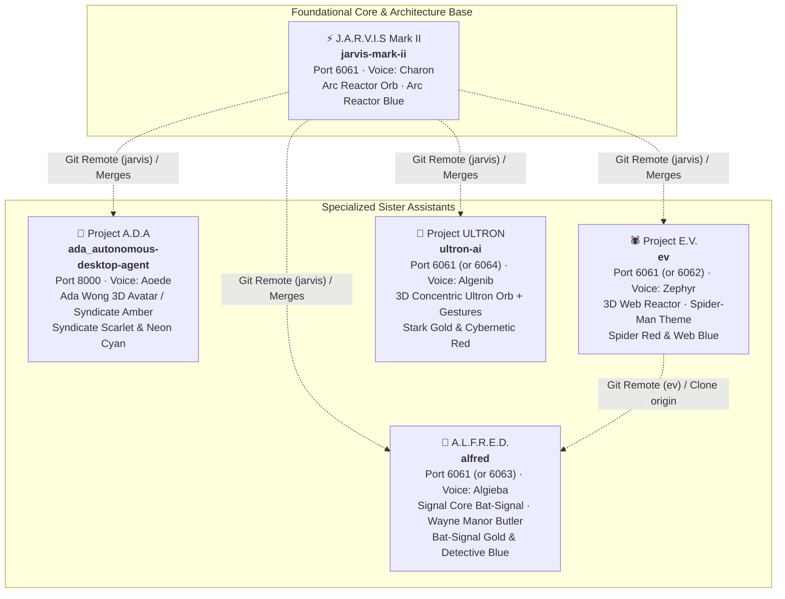
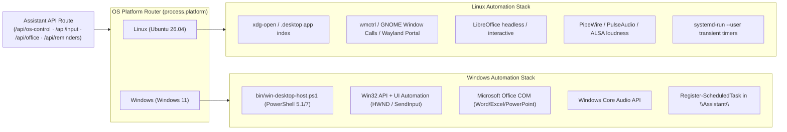

# 🌐 DESKTOP AI ECOSYSTEM & CROSS-MACHINE SPECIFICATION

**Fleet Identifier:** Desktop AI Unified Fleet  
**Root Lineage:** [`jarvis-mark-ii`](../../jarvis-mark-ii/docs/ARCHITECTURE.md) (originating from the early A.D.A prototype)  
**Dual-Machine Topology:** Linux Workstation (`/home/bhavyajustchill/dev/_Fun/desktop_ai`) & Windows Workstation (`F:\__Development\__Fun\desktop_ai`)  
**Portable Relative Standard:** `../<sibling-project>` from repo root, `../../<sibling-project>/docs/` from docs  

---

## 1. Executive Fleet Overview

The **Desktop AI Ecosystem** consists of five autonomous, voice-first desktop assistants developed by the operator. All five assistants share a core engineering foundation powered by **Next.js 16 (App Router + Turbopack)**, **Pure JavaScript & JSX**, **React Three Fiber / Three.js 3D visual cores**, the **Gemini 3.8 Live WebSocket API** (`models/gemini-3.8-live`), bidirectional 16kHz/24kHz low-latency audio streaming, and deep operating system desktop automation.

Each assistant possesses a distinctive persona, dedicated visual core, signature color palette, specialized voice matrix, and tailored user interface while maintaining feature parity across desktop control, sandboxed filesystem operations, semantic memory vault, session archive, and terminal execution.



---

## 2. Fleet Comparative Matrix

| Assistant | Folder Name | Codename & Persona | Default Port | Default Voice | 3D Visual Core | Primary UI Theme | Key Documentation |
| :--- | :--- | :--- | :--- | :--- | :--- | :--- | :--- |
| **J.A.R.V.I.S Mark II** | `jarvis-mark-ii` | Mark II // Iron Man AI Companion. Refined British cadence, composed, witty, analytical. | `6061` | **Charon** (Male) | Holographic Arc Reactor Orb (`ArcReactorOrb.jsx`) | Arc Reactor Blue (`#00C3FF`) on Carbon (`#010E16`) | [`jarvis/ARCH`](../../jarvis-mark-ii/docs/ARCHITECTURE.md) · [`jarvis/PRD`](../../jarvis-mark-ii/docs/PRD.md) · [`jarvis/RULES`](../../jarvis-mark-ii/docs/RULES.md) |
| **Project A.D.A** | `ada_autonomous-desktop-agent` | Cyber-Grid // Ada Wong (Resident Evil). Enigmatic, calm, ironic, sophisticated operative. | `8000` | **Aoede** (Female) | Rigged 3D Ada Wong Avatar (`adawong_posed.glb`) or Syndicate Amber Core | Syndicate Scarlet (`#FF003C`) & Neon Cyan (`#00F0FF`) | [`ada/ARCH`](../../ada_autonomous-desktop-agent/docs/ARCHITECTURE.md) · [`ada/PARITY`](../../ada_autonomous-desktop-agent/docs/JARVIS_PARITY_PLAN.md) · [`ada/PRD`](../../ada_autonomous-desktop-agent/docs/PRD.md) |
| **A.L.F.R.E.D.** | `alfred` | Alfred // Wayne Manor Butler (Batman). Calm, unhurried, bone-dry understatement, truth-teller. | `6061` *(opt: 6063)* | **Algieba** (Male) | Holographic Signal Core Bat-Signal (`SignalCore.jsx`) & Skyline | Bat-Signal Gold (`#FFC233`) & Detective Blue (`#4DA3FF`) | [`alfred/ARCH`](../../alfred/docs/ARCHITECTURE.md) · [`alfred/PRD`](../../alfred/docs/PRD.md) · [`alfred/PHASES`](../../alfred/docs/PHASES.md) |
| **Project E.V.** | `ev` | E.V. // Spider-Grade AI (Spider-Man). Upbeat, quick, teasing, warm, protective. | `6061` *(opt: 6062)* | **Zephyr** (Female) | Holographic 3D Web Reactor (`WebReactor.jsx`) with dual voice arcs | Spider Red (`#FF2A3D`) & Web Blue (`#00D4FF`) | [`ev/ARCH`](../../ev/docs/ARCHITECTURE.md) · [`ev/PRD`](../../ev/docs/PRD.md) · [`ev/MEMORY`](../../ev/docs/MEMORY.md) |
| **Project ULTRON** | `ultron-ai` | Ultron // Cybernetic Super-Intelligence. Imposing, calculated, cold supremacy (James Spader). | `6061` *(opt: 6064)* | **Algenib** (Male) | 3D Concentric Ultron Orb (`ultronOrbScene.js`) with MediaPipe gestures | Stark Gold (`#FFB800`) & Multi-Theme Selector | [`ultron/ARCH`](../../ultron-ai/docs/ARCHITECTURE.md) · [`ultron/PARITY`](../../ultron-ai/docs/JARVIS_PARITY_PLAN.md) · [`ultron/PRD`](../../ultron-ai/docs/PRD.md) |

---

## 3. Dual-Machine Workstation Topology

The operator develops and operates these assistants across two physical workstations. Both machines maintain an identical sibling folder layout under their respective root workspace directory:

```text
========================================================================================
MACHINE 1: LINUX WORKSTATION (Ubuntu 26.04 LTS / GNOME Wayland / Bash)
Root Workspace: /home/bhavyajustchill/dev/_Fun/desktop_ai/
========================================================================================
/home/bhavyajustchill/dev/_Fun/desktop_ai/
├── jarvis-mark-ii/                  # Port 6061 · Base reference
│   ├── docs/                        # Architecture, PRD, Rules, Memory, Ecosystem
│   └── ...
├── ada_autonomous-desktop-agent/     # Port 8000 · Concurrent runner
│   ├── docs/
│   └── ...
├── alfred/                          # Port 6061 (or 6063) · Batman butler
│   ├── docs/
│   └── ...
├── ev/                              # Port 6061 (or 6062) · Spider-Tech
│   ├── docs/
│   └── ...
└── ultron-ai/                       # Port 6061 (or 6064) · Super-intelligence
    ├── docs/
    └── ...

========================================================================================
MACHINE 2: WINDOWS WORKSTATION (Windows 11 / PowerShell 5.1/7 / CMD)
Root Workspace: F:\__Development\__Fun\desktop_ai\
========================================================================================
F:\__Development\__Fun\desktop_ai\
├── jarvis-mark-ii\                  # Port 6061 · Base reference
│   ├── docs\
│   └── ...
├── ada_autonomous-desktop-agent\     # Port 8000 · Concurrent runner
│   ├── docs\
│   └── ...
├── alfred\                          # Port 6061 (or 6063)
│   ├── docs\
│   └── ...
├── ev\                              # Port 6061 (or 6062)
│   ├── docs\
│   └── ...
└── ultron-ai\                       # Port 6061 (or 6064)
    ├── docs\
    └── ...
```

### 3.1 The Universal Portable Relative Standard

Because both machines use an identical sibling directory structure under `desktop_ai/`:

1. **Relative Directory Navigation:**
   - Navigating between sibling projects from repo root: `../<sibling>`  
     *(e.g., from `ultron-ai` to Jarvis: `cd ../jarvis-mark-ii`)*
   - Cross-project markdown documentation links from `docs/`: `../../<sibling>/docs/<file>.md`  
     *(e.g., `../../jarvis-mark-ii/docs/ARCHITECTURE.md`)*
2. **Universal Git Remotes:**
   - Git supports relative local repository paths natively on both Linux and Windows.
   - Setting a remote using `../jarvis-mark-ii` works identically across machines without needing to reconfigure git remotes when synchronizing repositories:
     ```bash
     # In ada, alfred, ev, or ultron-ai:
     git remote set-url jarvis ../jarvis-mark-ii
     # In alfred to point to ev:
     git remote set-url ev ../ev
     ```
3. **Machine-Specific Absolute Path Fallback:**
   - **Linux:** `/home/bhavyajustchill/dev/_Fun/desktop_ai/<project>`
   - **Windows:** `F:\__Development\__Fun\desktop_ai\<project>`

---

## 4. Cross-Repository Git Synchronization & Parity Workflow

All derivative projects maintain local git remotes pointing to `jarvis-mark-ii` (and `ev` in the case of `alfred`). This allows new engine features, bug fixes, and API upgrades authored in `jarvis-mark-ii` to be fetched and merged smoothly into any sister assistant.

### 4.1 Git Remotes Configuration Table

| Repository | Remote Name | Portable Relative URL (Recommended) | Linux Absolute URL | Windows Absolute URL |
| :--- | :--- | :--- | :--- | :--- |
| `ada_autonomous-desktop-agent` | `jarvis` | `../jarvis-mark-ii` | `/home/bhavyajustchill/dev/_Fun/desktop_ai/jarvis-mark-ii` | `F:\__Development\__Fun\desktop_ai\jarvis-mark-ii` |
| `ada_autonomous-desktop-agent` | `origin` | `git@github.com:bhavyajustchill/ada_autonomous-desktop-agent.git` | Same | Same |
| `alfred` | `jarvis` | `../jarvis-mark-ii` | `/home/bhavyajustchill/dev/_Fun/desktop_ai/jarvis-mark-ii` | `F:\__Development\__Fun\desktop_ai\jarvis-mark-ii` |
| `alfred` | `ev` | `../ev` | `/home/bhavyajustchill/dev/_Fun/desktop_ai/ev` | `F:\__Development\__Fun\desktop_ai\ev` |
| `alfred` | `origin` | `git@github.com:bhavyajustchill/alfred-batman-ai.git` | Same | Same |
| `ev` | `jarvis` | `../jarvis-mark-ii` | `/home/bhavyajustchill/dev/_Fun/desktop_ai/jarvis-mark-ii` | `F:\__Development\__Fun\desktop_ai\jarvis-mark-ii` |
| `ev` | `origin` | `git@github.com:bhavyajustchill/ev-spider-man-bnd.git` | Same | Same |
| `ultron-ai` | `jarvis` | `../jarvis-mark-ii` | `/home/bhavyajustchill/dev/_Fun/desktop_ai/jarvis-mark-ii` | `F:\__Development\__Fun\desktop_ai\jarvis-mark-ii` |
| `ultron-ai` | `origin` | `git@github.com:bhavyajustchill/ultron-ai.git` | Same | Same |
| `jarvis-mark-ii` | `origin` | `git@github.com:bhavyajustchill/jarvis-mark-ii.git` | Same | Same |

### 4.2 Syncing Upgrades from Jarvis Mark II

When a new feature, bug fix, or tool is added to `jarvis-mark-ii`:

```bash
# 1. Inside any sibling assistant directory (e.g. ultron-ai or ada_autonomous-desktop-agent):
cd ../ultron-ai

# 2. Fetch latest commits from jarvis
git fetch jarvis

# 3. Inspect incoming diff against experimental or master branch
git log -n 5 jarvis/experimental --oneline
git diff HEAD...jarvis/experimental --stat

# 4. Merge or cherry-pick features while preserving project persona & styling:
git merge jarvis/experimental --no-commit
# Verify that unique 3D visual cores, brand colors, and personas are preserved
git commit -m "Merge core upgrades from J.A.R.V.I.S Mark II"
```

---

## 5. Multi-Assistant Process & Port Management

The assistants are designed to co-exist without fighting over operating system resources or ports.

### 5.1 Port Allocation Strategy

- **Project A.D.A:** Runs on port **`8000`** (`http://localhost:8000`). It can run simultaneously alongside any of the other assistants.
- **J.A.R.V.I.S Mark II, E.V., A.L.F.R.E.D., and Ultron:** By default share port **`6061`** so that the operator's saved browser `localStorage` credentials and Gemini API key are immediately accessible without re-entry.
  - To run them simultaneously on distinct ports, pass `-p <port>` to `npm run dev`:
    - Jarvis: `6061` (`npm run dev`)
    - E.V.: `6062` (`npx next dev -H 0.0.0.0 -p 6062`)
    - Alfred: `6063` (`npx next dev -H 0.0.0.0 -p 6063`)
    - Ultron: `6064` (`npx next dev -H 0.0.0.0 -p 6064`)

### 5.2 OS Isolation & Collision Prevention

To prevent assistants from clobbering each other's timers, autostart entries, browser profiles, and data files, each assistant maintains strictly isolated namespaces:

| Resource | Jarvis Mark II | Project A.D.A | A.L.F.R.E.D. | Project E.V. | Project ULTRON |
| :--- | :--- | :--- | :--- | :--- | :--- |
| **Linux Autostart** | `jarvis-mark-ii.desktop` | `ada-assistant.desktop` | `alfred-assistant.desktop` | `ev-assistant.desktop` | `ultron-assistant.desktop` |
| **Linux Launcher** | `~/.local/share/jarvis-mark-ii/` | `~/.local/share/ada-assistant/` | `~/.local/share/alfred-assistant/` | `~/.local/share/ev-assistant/` | `~/.local/share/ultron-assistant/` |
| **Browser Profile** | `.../jarvis-mark-ii/browser-profile` | `.../ada-assistant/browser-profile` | `.../alfred-assistant/browser-profile` | `.../ev-assistant/browser-profile` | `.../ultron-assistant/browser-profile` |
| **Reminders (Linux)** | `systemd-run --user` unit `jarvis-reminder-*` | `ada-reminder-*` | `alfred-reminder-*` | `ev-reminder-*` | `ultron-reminder-*` |
| **Reminders (Windows)**| `\Jarvis\` task folder | `\Ada\` task folder | `\Alfred\` task folder | `\EV\` task folder | `\Ultron\` task folder |
| **Project Output** | `~/Desktop/JarvisProjects` | `~/Desktop/AdaProjects` | `~/Desktop/AlfredProjects` | `~/Desktop/EVProjects` | `~/Desktop/UltronProjects` |
| **Created Docs** | `Jarvis Documents` | `Ada Documents` | `Alfred Documents` | `EV Documents` | `Ultron Documents` |

---

## 6. Cross-Platform OS Automation Architecture

Every assistant implements cross-platform companion engines that detect whether the runtime host is Linux or Windows and dispatch commands to native host facilities:



### 6.1 Platform Capabilities Matrix

1. **Desktop GUI & Window Automation:**
   - **Linux:** Evaluates Wayland RemoteDesktop portal, `ydotool`, `xdotool`, and GNOME Window Calls over D-Bus (`lib/inputControl.js`). Window focus verification ensures keystrokes target the intended application.
   - **Windows:** Spawns a persistent background PowerShell session running `bin/win-desktop-host.ps1` communicating via JSON lines over stdin/stdout (`lib/winDesktop.js`). Utilizes Win32 `SetForegroundWindow`, `ShowWindow`, and `SendInput`.
2. **Office Suite Automation:**
   - **Linux:** Launches LibreOffice via CLI with sandboxed file paths and focus-checked synthetic keystrokes (`lib/officeControl.js`).
   - **Windows:** Binds directly to Microsoft Office COM automation objects (`Word.Application`, `Excel.Application`, `PowerPoint.Application`).
3. **Master Volume Control:**
   - **Linux:** Cascades through PipeWire (`wpctl`), PulseAudio (`pactl`), and ALSA (`amixer`).
   - **Windows:** Uses the `loudness` native binding with a fallback to Windows Core Audio PowerShell scripts.
4. **Scheduled Reminders & Alarms:**
   - **Linux:** Creates transient `systemd-run --user` timers triggering `notify-send --urgency=critical` with alarm sound hints. Survives until fired or rebooted.
   - **Windows:** Registers scheduled tasks under `\<Assistant>\` using `Register-ScheduledTask` with ISO wall-clock triggers.
5. **Autostart on Login:**
   - **Linux:** Deploys an XDG autostart `.desktop` file into `~/.config/autostart/` executing the assistant's launcher script.
   - **Windows:** Deploys a startup launcher script (`.cmd`) into `%APPDATA%\Microsoft\Windows\Start Menu\Programs\Startup\`.

---

## 7. Direct Documentation Cross-Links

Jump directly to documentation for any assistant in the ecosystem:

### J.A.R.V.I.S Mark II
- [Architecture Blueprint](../../jarvis-mark-ii/docs/ARCHITECTURE.md)
- [Product Requirements Document (PRD)](../../jarvis-mark-ii/docs/PRD.md)
- [Coding Rules & Guardrails](../../jarvis-mark-ii/docs/RULES.md)
- [UI Design Specification](../../jarvis-mark-ii/docs/DESIGN.md)
- [Context Memory Log](../../jarvis-mark-ii/docs/MEMORY.md)
- [Feature Progression (Phases)](../../jarvis-mark-ii/docs/PHASES.md)

### Project A.D.A
- [Architecture Blueprint](../../ada_autonomous-desktop-agent/docs/ARCHITECTURE.md)
- [Jarvis Parity Implementation Plan](../../ada_autonomous-desktop-agent/docs/JARVIS_PARITY_PLAN.md)
- [Product Requirements Document (PRD)](../../ada_autonomous-desktop-agent/docs/PRD.md)
- [Coding Rules & Guardrails](../../ada_autonomous-desktop-agent/docs/RULES.md)
- [UI Design Specification](../../ada_autonomous-desktop-agent/docs/DESIGN.md)
- [Context Memory Log](../../ada_autonomous-desktop-agent/docs/MEMORY.md)
- [Feature Progression (Phases)](../../ada_autonomous-desktop-agent/docs/PHASES.md)

### A.L.F.R.E.D.
- [Architecture Blueprint](../../alfred/docs/ARCHITECTURE.md)
- [Product Requirements Document (PRD)](../../alfred/docs/PRD.md)
- [Coding Rules & Guardrails](../../alfred/docs/RULES.md)
- [UI Design Specification](../../alfred/docs/DESIGN.md)
- [Context Memory Log](../../alfred/docs/MEMORY.md)
- [Feature Progression (Phases)](../../alfred/docs/PHASES.md)

### Project E.V.
- [Architecture Blueprint](../../ev/docs/ARCHITECTURE.md)
- [Product Requirements Document (PRD)](../../ev/docs/PRD.md)
- [Coding Rules & Guardrails](../../ev/docs/RULES.md)
- [UI Design Specification](../../ev/docs/DESIGN.md)
- [Context Memory Log](../../ev/docs/MEMORY.md)
- [Feature Progression (Phases)](../../ev/docs/PHASES.md)

### Project ULTRON
- [Architecture Blueprint](../../ultron-ai/docs/ARCHITECTURE.md)
- [Jarvis Parity Implementation Plan](../../ultron-ai/docs/JARVIS_PARITY_PLAN.md)
- [Product Requirements Document (PRD)](../../ultron-ai/docs/PRD.md)
- [Coding Rules & Guardrails](../../ultron-ai/docs/RULES.md)
- [UI Design Specification](../../ultron-ai/docs/DESIGN.md)
- [Context Memory Log](../../ultron-ai/docs/MEMORY.md)
- [Feature Progression (Phases)](../../ultron-ai/docs/PHASES.md)
